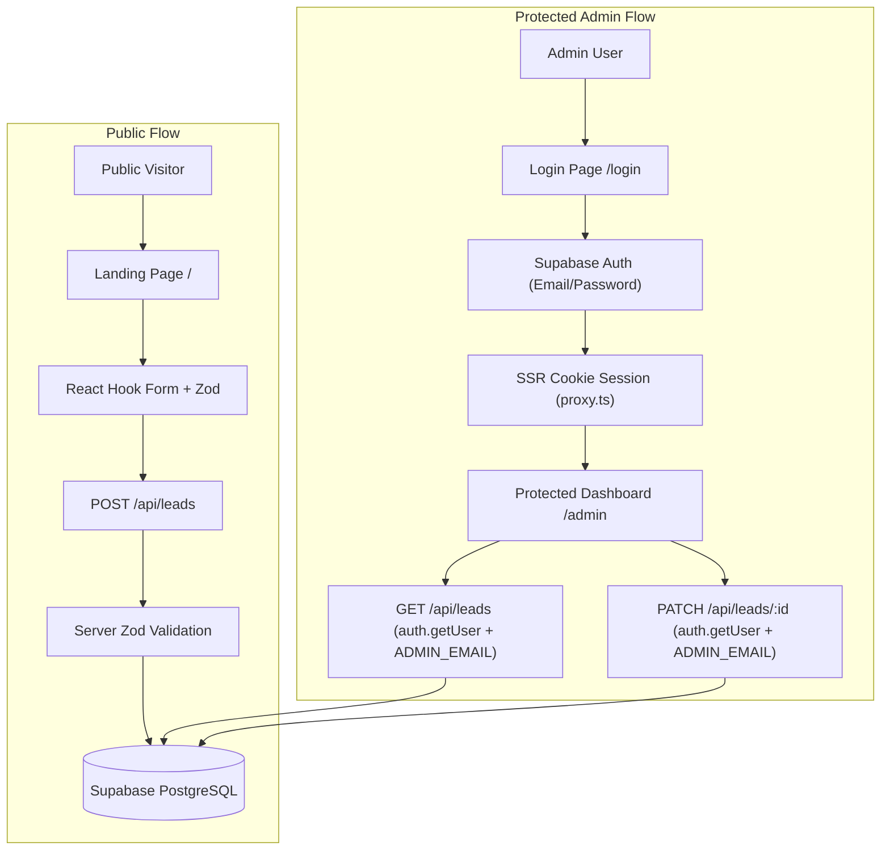

# LeadDesk Mini


LeadDesk Mini is a full-stack lead-capture application built with Next.js 16 App Router, TypeScript, Tailwind CSS, and Supabase PostgreSQL. Visitors can submit project enquiries through a responsive public landing page, while authorized administrators manage, search, filter, and track leads in a secure, protected dashboard.

---

## Live Deployment

- **Landing Page**: [https://leaddesk-mini-phi.vercel.app](https://leaddesk-mini-phi.vercel.app)
- **Login Page**: [https://leaddesk-mini-phi.vercel.app/login](https://leaddesk-mini-phi.vercel.app/login)
- **Admin Dashboard**: [https://leaddesk-mini-phi.vercel.app/admin](https://leaddesk-mini-phi.vercel.app/admin)

---

## Key Features

- **Public Lead Capture Form**: Responsive form with fields for Full Name, Email Address, Budget Range, and Message.
- **Dual-Layer Input Validation**: Client-side validation powered by React Hook Form and Zod; server-side Zod validation on API routes.
- **Supabase PostgreSQL Persistence**: All valid leads are stored securely in a PostgreSQL `leads` table with a default status of `new`.
- **Real Supabase Authentication**: Email/password authentication using `@supabase/ssr` with secure cookie-based session management.
- **Protected Admin Pages & APIs**: Server-side route protection via `src/proxy.ts` and API protection via `requireAdmin()` verifying `auth.getUser()` and restricting access to `ADMIN_EMAIL`.
- **Admin Dashboard & Lead Management**:
  - Live metric summary cards (Total Leads, New, Contacted, Closed)
  - Debounced search across lead names and email addresses
  - Status filter dropdown (`New`, `Contacted`, `Closed`)
  - Inline status update dropdown per lead persisting to PostgreSQL
  - Responsive layout (desktop table view and mobile stacked cards)
  - User context display and Sign Out functionality
  - Loading skeleton, empty states, and error handling with retry
- **Login UX Features**: Password visibility toggle (eye icon) and password reset request via email.
- **Vercel Deployment**: Configured for seamless deployment on Vercel with environment variable configuration.

---

## Tech Stack

| Layer | Tool / Library | Purpose |
|---|---|---|
| **Framework** | Next.js 16 (App Router) | Full-stack React framework with SSR & API routes |
| **Language** | TypeScript | Type safety across client components and server code |
| **Styling** | Tailwind CSS v4 | Responsive, utility-first UI styling |
| **Form Management** | React Hook Form | Efficient client-side form state and validation |
| **Validation** | Zod | Shared schema validation for browser and server |
| **Database** | Supabase PostgreSQL | Hosted PostgreSQL database with real-time capabilities |
| **Authentication** | Supabase Auth (`@supabase/ssr`) | Cookie-based SSR sessions & auth management |
| **Database Client** | `@supabase/supabase-js` | Direct database queries in server API handlers |
| **Hosting** | Vercel | Production deployment & environment hosting |

---

## Architecture & Data Flow



---

## Data Model

The application uses a single PostgreSQL table named `leads` with an ENUM type for status tracking.

### `leads` Table Schema

| Column | Type | Rules | Description |
|---|---|---|---|
| `id` | `UUID` | Primary Key, `default gen_random_uuid()` | Unique lead identifier |
| `name` | `VARCHAR(80)` | Required, 2–80 chars | Visitor full name |
| `email` | `VARCHAR(254)` | Required, valid email | Visitor contact email |
| `budget_range` | `VARCHAR(30)` | Required | Selected project budget range |
| `message` | `VARCHAR(1000)` | Required, 10–1000 chars | Project description / enquiry |
| `status` | `lead_status` ENUM | Default `'new'` | Lead status: `'new'`, `'contacted'`, `'closed'` |
| `created_at` | `TIMESTAMPTZ` | Default `now()` | Submission timestamp |
| `updated_at` | `TIMESTAMPTZ` | Default `now()` | Last modification timestamp |

### Database SQL Schema

```sql
create type lead_status as enum ('new', 'contacted', 'closed');

create table public.leads (
  id uuid primary key default gen_random_uuid(),
  name varchar(80) not null,
  email varchar(254) not null,
  budget_range varchar(30) not null,
  message varchar(1000) not null,
  status lead_status not null default 'new',
  created_at timestamptz not null default now(),
  updated_at timestamptz not null default now()
);

create index leads_created_at_idx on public.leads (created_at desc);
create index leads_status_idx on public.leads (status);
create index leads_email_idx on public.leads (email);
```

---

## Authentication & Security

1. **Cookie-based SSR Sessions**: Built with `@supabase/ssr`. Sessions are refreshed automatically on incoming requests via Next.js proxy middleware (`src/proxy.ts`).
2. **Route Guarding**: Visiting `/admin` without an active session automatically redirects to `/login?next=/admin`.
3. **Server-side Email Authorization**: A reusable `requireAdmin()` helper calls `auth.getUser()` on the server and verifies that the authenticated user's email matches `ADMIN_EMAIL`. Requests without a valid session return `401 Unauthorized`; requests from non-admin emails return `403 Forbidden`.
4. **Credential Isolation**:
   - `NEXT_PUBLIC_SUPABASE_URL` and `NEXT_PUBLIC_SUPABASE_PUBLISHABLE_KEY` are safe for browser use.
   - `SUPABASE_SERVICE_ROLE_KEY` remains strictly server-only and is used exclusively in backend API routes.
   - No API keys, credentials, or secrets are committed to Git.

---

## API Endpoints

| Method | Endpoint | Protection | Purpose | Response |
|---|---|---|---|---|
| `POST` | `/api/leads` | **Public** | Submit a new lead enquiry | `201 Created` / `400 Bad Request` |
| `GET` | `/api/leads` | **Admin Only** | Fetch and search/filter saved leads | `200 OK` / `401` / `403` |
| `PATCH` | `/api/leads/:id` | **Admin Only** | Update lead status (`new`, `contacted`, `closed`) | `200 OK` / `400` / `401` / `403` / `404` |

---

## Local Setup Instructions

### Prerequisites
- Node.js (v18 or higher)
- npm or yarn

### Steps

1. **Clone the repository**:
   ```bash
   git clone https://github.com/Sarwang-Mangal/leaddesk-mini.git
   cd leaddesk-mini
   ```

2. **Install dependencies**:
   ```bash
   npm install --legacy-peer-deps
   ```

3. **Configure Environment Variables**:
   Copy `.env.example` to `.env.local`:
   ```bash
   cp .env.example .env.local
   ```
   Fill in your Supabase project credentials in `.env.local`:
   ```env
   SUPABASE_URL=https://your-project-ref.supabase.co
   SUPABASE_SERVICE_ROLE_KEY=your-server-only-service-role-key
   NEXT_PUBLIC_SUPABASE_URL=https://your-project-ref.supabase.co
   NEXT_PUBLIC_SUPABASE_PUBLISHABLE_KEY=your-publishable-key
   ADMIN_EMAIL=your-admin-email@example.com
   ```

4. **Set up PostgreSQL Database**:
   Open the **SQL Editor** in your Supabase Dashboard and run the SQL schema provided in the [Data Model](#data-model) section.

5. **Run Development Server**:
   ```bash
   npm run dev
   ```
   Open [http://localhost:3000](http://localhost:3000) in your browser.

---

## Deployment

### Vercel Deployment Steps

1. Push your repository to GitHub.
2. Import the repository into **Vercel**.
3. Configure the following Environment Variables in Vercel Project Settings (for Production & Preview):
   - `SUPABASE_URL`
   - `SUPABASE_SERVICE_ROLE_KEY`
   - `NEXT_PUBLIC_SUPABASE_URL`
   - `NEXT_PUBLIC_SUPABASE_PUBLISHABLE_KEY`
   - `ADMIN_EMAIL`
4. Deploy the project.
5. In Supabase Dashboard → **Authentication** → **URL Configuration**, add your live Vercel URL to **Redirect URLs**:
   - `https://leaddesk-mini-phi.vercel.app/login`
   - `https://leaddesk-mini-phi.vercel.app/**`

---

## Testing Checklist

### Public Landing Page & Lead Form
- [x] Submitting empty form displays inline field error messages.
- [x] Entering invalid email format displays a specific email validation error.
- [x] Short message (< 10 characters) is rejected with an error.
- [x] Valid submission saves lead to Supabase with default status `new` and shows success message.

### Authentication & Authorization
- [x] Direct navigation to `/admin` in an incognito window redirects to `/login?next=/admin`.
- [x] Direct `GET /api/leads` request without session cookies returns `401 Unauthorized`.
- [x] Signing in with invalid credentials displays an error message.
- [x] Signing in with valid admin credentials redirects to `/admin` dashboard.
- [x] Clicking **Sign out** clears session cookies and redirects to `/login`.

### Admin Dashboard
- [x] Metrics cards display accurate counts for Total, New, Contacted, and Closed leads.
- [x] Search input filters leads by name and email (250ms debounced).
- [x] Status dropdown filter isolates leads by status.
- [x] Updating a lead's status updates PostgreSQL and persists after page refresh.
- [x] Mobile viewport displays readable stacked lead cards.

---

## Loom Walkthrough

📹 **Video Demo**: _[Insert Loom Video Link Here]_

---

## Future Production Improvements

- **Supabase Auth Email Templates**: Customize branded HTML templates for password resets and magic links.
- **Role-Based Access Control (RBAC)**: Extend database schema to support multiple admin roles (e.g., `SuperAdmin`, `Viewer`, `Editor`).
- **Pagination & Export**: Add server-side pagination for large lead datasets and CSV export functionality for admin reports.
- **Automated Email Notifications**: Trigger instant email notifications to administrators when a new high-budget lead is submitted via Supabase Database Webhooks.

---

## Submission & Credential Security Note

Admin evaluation credentials for testing are provided privately to the evaluator in the task submission. No test passwords, database credentials, or secret keys are stored in source code or committed to this public repository.

---

<p align="center">
  Built for <strong><a href="https://digitalheroesco.com">Digital Heroes Training Task</a></strong>
</p>
